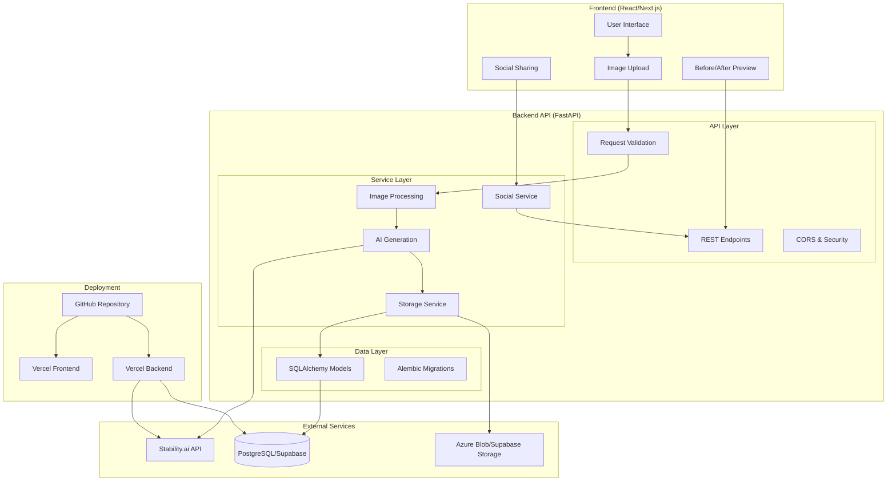
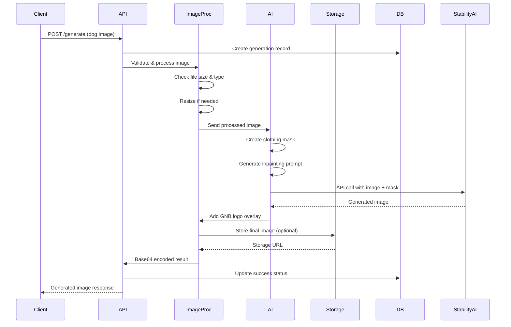

# GNB Dog Image Generation - Architecture

## 🏗️ System Architecture

### High-Level Architecture Diagram

## 🔧 Core Components

### 1. API Layer (`api/`)

**Purpose**: HTTP request handling, validation, and routing

**Components**:
- `v1/endpoints.py`: Main API endpoints
- `schemas.py`: Pydantic models for request/response validation

**Key Endpoints**:
- `POST /api/v1/generate`: Core image generation
- `GET /api/v1/health`: Service health monitoring
- `POST /api/v1/share`: Social media sharing preparation
- `GET /api/v1/gallery`: Recent generations showcase

### 2. Service Layer (`services/`)

**Purpose**: Business logic and external service integration

**Components**:
- `stability_ai_generation.py`: AI image generation with inpainting
- `image_processing.py`: Image validation, resizing, logo overlay
- `azure_storage.py`: Cloud storage management
- `supabase_storage.py`: Alternative storage solution

**Key Features**:
- Mask-based image editing for precise apparel placement
- Comprehensive error handling with custom exceptions
- Optimized image processing pipeline
- Logo overlay with brand compliance

### 3. Data Layer (`models/` & `database/`)

**Purpose**: Data persistence and analytics

**Components**:
- `image_generation.py`: Generation tracking model
- `connection.py`: Database connection management
- `migrations/`: Alembic database migrations

**Data Flow**:
1. Track generation requests with metadata
2. Store processing times and success rates
3. Enable analytics and performance monitoring
4. Support generation history retrieval

### 4. Configuration (`config/`)

**Purpose**: Environment-based configuration management

**Features**:
- Pydantic-based settings with validation
- Support for multiple deployment environments
- Feature flags for optional services
- Secure credential management

### 5. Utilities (`utils/`)

**Purpose**: Cross-cutting concerns and helpers

**Components**:
- `exceptions.py`: Custom exception classes
- `logging_config.py`: Structured JSON logging
- Performance monitoring and request tracking

## 🔄 Request Flow

### Image Generation Pipeline

## 🛡️ Security Architecture

### Input Validation
- File size limits (10MB max)
- MIME type validation (JPEG, PNG, WebP)
- Image format verification
- Malicious file detection

### Error Handling
- Custom exception hierarchy
- Sensitive data sanitization
- Structured error responses
- Comprehensive logging without data exposure

### CORS Configuration
- Explicit origin allowlisting
- Credential support for authenticated requests
- Method and header restrictions

## 📊 Performance Architecture

### Optimization Strategies
- Image resizing before AI processing
- Asynchronous request handling
- Connection pooling for database
- Efficient memory management

### Monitoring
- Request/response timing
- AI generation performance metrics
- Error rate tracking
- Database query optimization

### Scalability
- Stateless service design
- Database connection pooling
- External storage for images
- Horizontal scaling ready

## 🚀 Deployment Architecture

### Vercel Deployment
- Serverless function deployment
- Automatic scaling based on demand
- Global edge network distribution
- Environment variable management

### Database Strategy
- Supabase for managed PostgreSQL
- Connection pooling for efficiency
- Migration-based schema management
- Real-time capabilities ready

### Storage Strategy
- Multiple storage backends supported
- Azure Blob Storage for production
- Supabase Storage for simplified setup
- Direct URL serving for generated images

## 🔮 Future Enhancements

### Planned Improvements
1. **Real-time Processing**: WebSocket support for live generation status
2. **Advanced AI**: Multiple clothing styles and seasonal collections
3. **User Management**: Account system with generation history
4. **Mobile Optimization**: Progressive Web App capabilities
5. **Analytics Dashboard**: Admin interface for business metrics

### Scalability Roadmap
1. **Caching Layer**: Redis for frequently generated images
2. **CDN Integration**: Global image delivery optimization
3. **Microservices**: Service decomposition for better scaling
4. **Queue System**: Background processing for heavy workloads

## 🧪 Testing Architecture

### Test Coverage Strategy
- **Unit Tests**: Service layer logic (>90% coverage)
- **Integration Tests**: API endpoint testing (>85% coverage)
- **Mock Testing**: External service simulation
- **Performance Tests**: Load testing for generation pipeline

### Test Environment
- In-memory SQLite for fast testing
- Mock external APIs (Stability.ai)
- Temporary file management
- Isolated test fixtures

## 📈 Performance Metrics

### Target Benchmarks
- **Generation Time**: <5 seconds 80% of the time
- **API Response**: <100ms for validation endpoints
- **Uptime**: >99.9% availability
- **Error Rate**: <1% for successful uploads

### Monitoring Points
- Generation success/failure rates
- Average processing times
- Storage usage trends
- API error distributions

---

This architecture demonstrates **AI-native development** principles:
- **Intelligent Service Selection**: Choosing Stability.ai for superior image editing capabilities
- **Prompt Engineering**: Sophisticated prompt creation for consistent brand results
- **Graceful Degradation**: Robust error handling with fallback strategies
- **Performance Optimization**: Efficient processing pipeline for sub-5-second generations